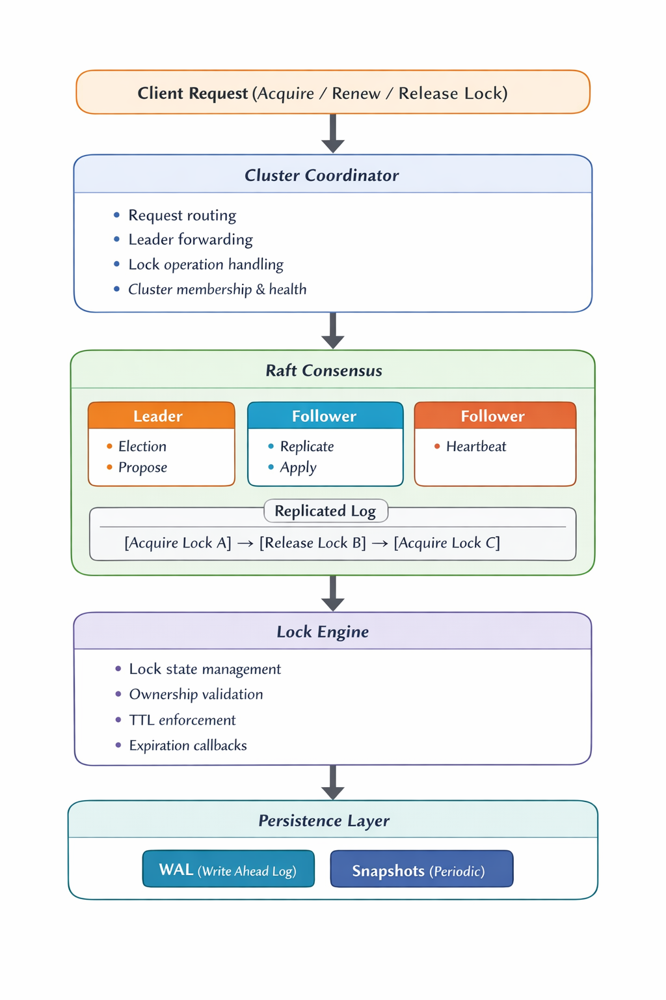

# Go Distributed Lock

A production-grade distributed lock system implemented in Go with **Raft consensus**, providing strong consistency guarantees across multiple nodes.

[](https://go.dev)
[](LICENSE)

## Features

### Core Functionality
- **Distributed Locking** - Acquire, renew, and release locks across a cluster
- **TTL Support** - Automatic lock expiration with configurable time-to-live
- **Lock Leasing** - Lease-based ownership with automatic renewal

### Consensus & Reliability
- **Raft Consensus** - Strong consistency via leader-based replication
- **Majority Quorum** - Operations require (n/2)+1 nodes for safety
- **Network Partition Handling** - Graceful degradation and recovery
- **Leader Election** - Automatic failover with randomized timeouts

### Durability
- **Write-Ahead Log (WAL)** - All operations logged before execution
- **Periodic Snapshots** - State persistence for fast recovery
- **Crash Recovery** - Full state restoration on restart

### Operations
- **Metrics & Monitoring** - Prometheus-compatible metrics
- **Health Checks** - Cluster and node health endpoints
- **Docker Support** - Easy containerized deployment

## Architecture



## Quick Start

### Prerequisites
- Go 1.23+
- Docker (optional, for containerized deployment)

### Build

```bash
# Clone the repository
git clone https://github.com/yourusername/go-distributed-lock.git
cd go-distributed-lock

# Build the binary
go build -o node ./cmd/node
```

### Run a Single Node

```bash
./node --id node1 --port 8001 --raft-port 9001
```

### Run a 3-Node Cluster

Terminal 1:
```bash
./node --id node1 --port 8001 --raft-port 9001 \
  --peers node2:localhost:9002,node3:localhost:9003
```

Terminal 2:
```bash
./node --id node2 --port 8002 --raft-port 9002 \
  --peers node1:localhost:9001,node3:localhost:9003
```

Terminal 3:
```bash
./node --id node3 --port 8003 --raft-port 9003 \
  --peers node1:localhost:9001,node2:localhost:9002
```

### Docker Compose

```bash
docker-compose up -d
```

## API Reference

### Acquire Lock

```http
POST /locks/acquire
Content-Type: application/json

{
  "key": "resource-1",
  "owner": "client-abc",
  "ttl": "30s"
}
```

Response:
```json
{
  "success": true,
  "lock": {
    "key": "resource-1",
    "owner": "client-abc",
    "ttl": "30s",
    "expires_at": "2024-01-15T10:30:30Z",
    "version": 1
  }
}
```

### Renew Lock

```http
POST /locks/renew
Content-Type: application/json

{
  "key": "resource-1",
  "owner": "client-abc",
  "ttl": "30s"
}
```

### Release Lock

```http
POST /locks/release
Content-Type: application/json

{
  "key": "resource-1",
  "owner": "client-abc"
}
```

### Get Lock Info

```http
GET /locks/{key}
```

### List Locks

```http
GET /locks
```

### Cluster Info

```http
GET /cluster/info
```

Response:
```json
{
  "leader_id": "node1",
  "term": 5,
  "nodes": [
    {"id": "node1", "state": "leader"},
    {"id": "node2", "state": "follower"},
    {"id": "node3", "state": "follower"}
  ],
  "quorum_size": 2,
  "has_quorum": true
}
```

## 🔧 Configuration

| Parameter | Default | Description |
|-----------|---------|-------------|
| `--id` | `node1` | Unique node identifier |
| `--port` | `8001` | HTTP API port |
| `--raft-port` | `9001` | Raft consensus port |
| `--data-dir` | `./data` | Data directory for persistence |
| `--peers` | - | Comma-separated peer list (id:addr:port) |
| `--election-timeout` | `150ms` | Base election timeout |
| `--heartbeat-interval` | `50ms` | Leader heartbeat interval |
| `--snapshot-interval` | `5m` | Automatic snapshot interval |

## Raft Consensus Implementation

### Leader Election

The system uses the Raft leader election algorithm:

1. **Randomized Timeouts**: Each node has a random election timeout (150-300ms) to prevent split votes
2. **Majority Quorum**: A candidate needs votes from (n/2)+1 nodes to become leader
3. **Term-based Priority**: Higher terms always take precedence

```go
// Election requires majority
votesNeeded := (len(peers)+1)/2 + 1
if votesReceived >= votesNeeded {
    node.becomeLeader()
}
```

### Log Replication

All lock operations are replicated via the Raft log:

1. Client sends lock request to leader
2. Leader appends command to local log
3. Leader replicates to followers via AppendEntries RPC
4. Once majority confirms, leader commits entry
5. Committed entries are applied to state machine

```
Leader Log:  [Acquire A] [Release B] [Acquire C] [Renew A]
Follower 1:  [Acquire A] [Release B] [Acquire C]
Follower 2:  [Acquire A] [Release B]
             ↑ committed (majority have it)
```

### Network Partition Handling

The system handles network partitions gracefully:

**Minority Partition Behavior:**
- Cannot elect a new leader (no quorum)
- Existing leader steps down after timeout
- Lock operations fail with "no quorum" error

**Majority Partition Behavior:**
- Elects new leader if needed
- Continues serving lock requests
- Maintains full functionality

**Partition Recovery:**
- Nodes in minority rejoin cluster
- Logs are reconciled with current leader
- State is synchronized automatically

```go
// Leader steps down if quorum is lost
if !partitionDetector.HasQuorum() {
    if quorumLostDuration > gracePeriod {
        node.StepDown()
    }
}
```

## Testing

### Run Unit Tests
```bash
go test -v ./...
```

### Run Raft Tests
```bash
go test -v ./internal/raft/...
```

### Test Coverage
```bash
go test -cover ./...
```

## Metrics

The system exposes Prometheus-compatible metrics:

| Metric | Type | Description |
|--------|------|-------------|
| `lock_acquire_total` | Counter | Total lock acquisitions |
| `lock_release_total` | Counter | Total lock releases |
| `lock_renew_total` | Counter | Total lock renewals |
| `lock_active_count` | Gauge | Currently held locks |
| `raft_term` | Gauge | Current Raft term |
| `raft_state` | Gauge | Node state (0=follower, 1=candidate, 2=leader) |
| `raft_commit_index` | Gauge | Current commit index |
| `raft_election_count` | Counter | Number of elections |

## Safety Guarantees

1. **Mutual Exclusion**: Only one owner can hold a lock at any time
2. **No Deadlocks**: TTL ensures locks are eventually released
3. **Linearizability**: All operations appear in a single total order
4. **Durability**: Committed operations survive failures
5. **No Split-Brain**: Majority quorum prevents conflicting leaders

## Contributing

1. Fork the repository
2. Create a feature branch (`git checkout -b feature/amazing-feature`)
3. Commit changes (`git commit -m 'Add amazing feature'`)
4. Push to branch (`git push origin feature/amazing-feature`)
5. Open a Pull Request

## License

This project is licensed under the MIT License - see the [LICENSE](LICENSE) file for details.

## Acknowledgments

- [Raft Paper](https://raft.github.io/raft.pdf) - Diego Ongaro and John Ousterhout
- [etcd](https://etcd.io/) - Inspiration for distributed systems design
- [HashiCorp Raft](https://github.com/hashicorp/raft) - Reference implementation

---

<p align="center">
  Made with ❤️ for distributed systems enthusiasts
</p>
